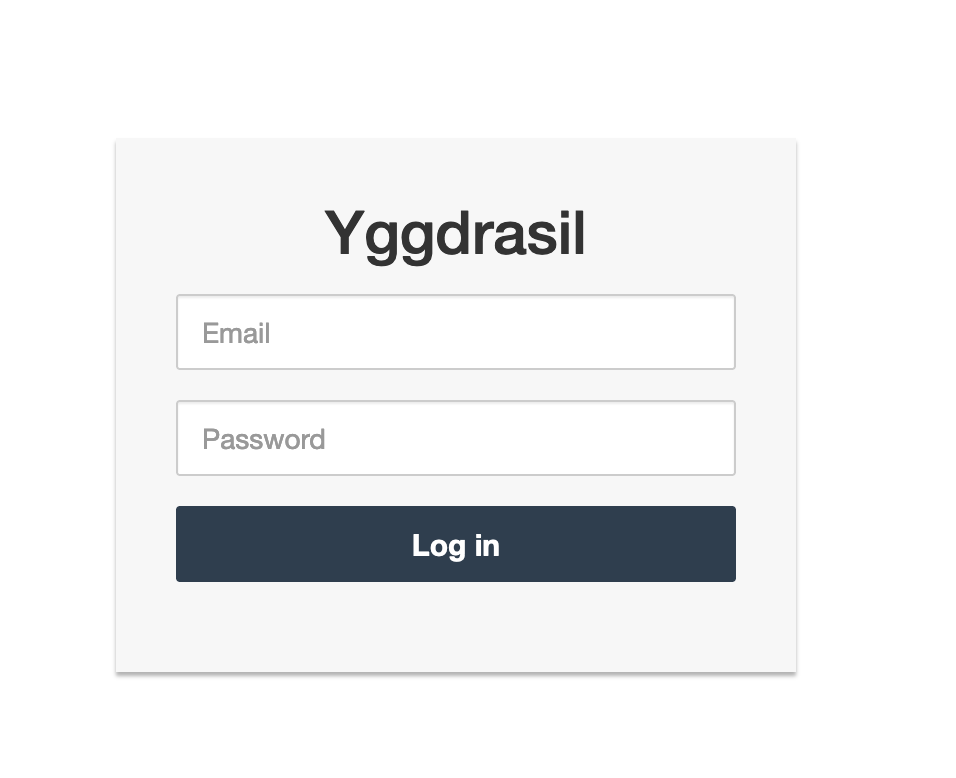
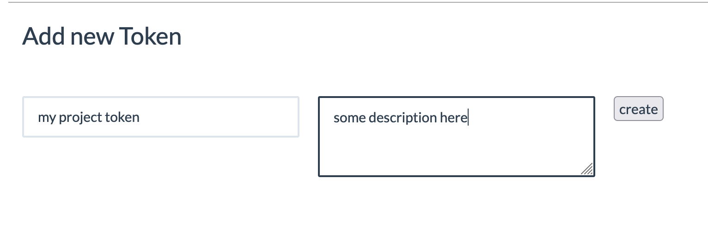

# Project Description

Yggdrasil is private rust registry server wich allows you to use it as a simple cache registry server or you can push your own rust packages.

Ygdrassil will be very usefull if you want to build your projects offline and if you want keep private your own developed rust projects.

# 1 Deployment

## 1.1 Deploy as systemd service

### 1.1.1 If you want use it as cache registry only
* Install system dependencies
```
# Use your os packet manager and install equivalent for your os packages
pacman -Sy uwsgi uwsgi-plugin-python
```
* Create system user:
```
useradd -s /sbin/nologin -M -c "Yggdrasil system user" yggdrasil
```
* Create work dirs:
```
mkdir {/opt/registry,/var/log/yggdrasil}
```

* Clone repository
```
cd /opt/registry && git clone https://github.com/medoedoff/yggdrasil.git
```
* Create .env file and insert variables
```
touch /opt/registry/yggdrasil/.env

# Insert it into .env file
APP_SETTINGS='config.ProductionConfig'
FLASK_ENV='production'
```

* Create venv, install dependencies and move systemd service file
```
python3 -m venv /opt/registry/yggdrasil/venv && \
/opt/registry/yggdrasil/venv/bin/python -m pip install -r /opt/registry/yggdrasil/requirements.txt && \
chown -R yggdrasil:yggdrasil {/opt/registry,/var/log/yggdrasil} && \
mv /opt/registry/yggdrasil/systemd/yggdrasil.unit /etc/systemd/system/yggdrasil.service && \
systemctl daemon-reload
```

* Start and enable service
```
systemctl start yggdrasil.service && systemctl enable yggdrasil.service
```

* Nginx
```
# Insert it into your nginx config
upstream yggdrasil { server unix:///opt/registry/yggdrasil/yggdrasil.sock; }

location / {
        uwsgi_param Host $host;
        uwsgi_param X-Real-IP $remote_addr;
        uwsgi_param X-Forwarded-For $proxy_add_x_forwarded_for;
        uwsgi_param X-Forwarded-Proto $http_x_forwarded_proto;
        uwsgi_pass  yggdrasil;
    }

# Check config
nginx -t

# If all ok
systemctl reload nginx
```
#### 1.1.1.1 Client side configurations
* Clone crates MUST to do at client side
```
cd /opt && \
git clone https://github.com/rust-lang/crates.io-index.git

# Then change config.json file
{
  "dl": "http://your_addres_here/api/v1/crates",
  "api": "http://your_addres_here"
}
```

* Change your cargo.conf
```
[source]

[source.mirror]
registry = "file:///opt/crates.io-index"

[source.crates-io]
replace-with = "mirror"
```

Try to build your project

### 1.1.2 Deploy with the ability to upload your packages into registry
* Same steps from 1.1.1 section but you should add at .env next variables
```
SECRET_KEY='YOUR_SECRET_KEY_HERE'
GIT_INDEX_PATH='/var/lib/yggdrasil/crates.io-index'
GIT_KEY_PATH='/var/lib/yggdrasil/id_rsa'
SQLALCHEMY_DATABASE_URI='sqlite:////var/lib/yggdrasil/yggdrasil.db' # or url to your database
SECURITY_PASSWORD_SALT='YOUR_PASSWORD_SALT_HERE'
```

* Create lib directory
```
mkdir /var/lib/yggdrasil
```

* Fork `crates.io-index` into your repo, and clone it into `/var/lib/yggdrasil` directory, path must be the same as `GIT_INDEX_PATH` variable in .env
* Generate new ssh private key and move it to `/var/lib/yggdrasil` directory, path must be the same as `GIT_KEY_PATH` variable in `.env`
* Add public key of recently generated ssh key into your repository user
* To escape errors, when application will try to push into forked repo add this configurations in `/var/lib/yggdrasil/crates.io-index/.git/config`:
```
[user]
  name = YOUR_NAME_HERE
  email = YOUR_EMAIL_HERE
```

* Init database
```
# Use this command inside project directory
venv/bin/python manage.py db init && \
venv/bin/python manage.py db migrate && \
venv/bin/python manage.py db upgrade
```

* Create super user
```
venv/bin/python manage.py createsuperuser
```

* Do not forget to change owner of lib dirs
```
chown -R yggdrasil:yggdrasil /var/lib/yggdrasil
```

#### 1.1.2.1 Push packet into registry
* Before you start I recommend you to name your project with prefix, for example `hdfb123-project_name` it needed to not this is necessary so that your package name does not match the public package name in the future
* Go to website http://address_where_registry_is_hosted

* Log In using super user credentials
* Create auth token

* Copy token and paste it in `cargo login` dialog
* Push your project into registry

## Deploy as Docker service
Will be available soon :)
